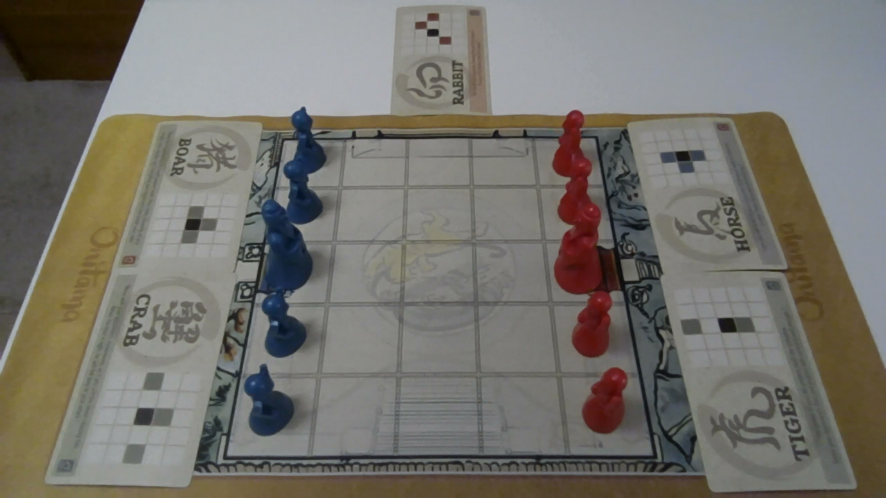

# TFG-Onitama

TFG-Onitama is an academic final project that brings together a complete **Onitama** rules engine, a search-based AI, and a computer-vision-assisted desktop application for playing on a **real physical board**.

The project is designed for a specific use case: a human plays Onitama on a physical board, a camera observes the board and cards, the software reconstructs the game state, validates legal transitions, and the AI answers with its own move. The main user-facing entry point is the desktop GUI, but the repository also includes supporting tools for testing, calibration, benchmarking, and experimentation.

## Table of Contents

1. [Implemented features](#1-implemented-features)
2. [Main technologies](#2-main-technologies)
3. [Requirements](#3-requirements)
4. [Installation](#4-installation)
5. [Running the project](#5-running-the-project)
   - [Desktop application](#51-desktop-application)
   - [First-time setup](#52-first-time-setup)
   - [Development and evaluation tools](#53-development-and-evaluation-tools)
6. [Project structure](#6-project-structure)
7. [Limitations](#7-limitations)
8. [Documentation](#8-documentation)
9. [Legal notice](#9-legal-notice)

## 1. Implemented features

- Complete Onitama rules engine with immutable game state, official card handling, and legal move generation.
- Search-based AI opponent with negamax, alpha-beta pruning, quiescence search, transposition tables, iterative deepening, aspiration windows, and move ordering heuristics.
- Vision pipeline that detects board pieces, classifies the five visible cards, and reconstructs a snapshot from camera frames.
- Logical integration layer that stabilizes repeated observations, validates legal one-ply transitions, and coordinates human/AI turn phases.
- Live runtime layer that opens the camera, runs the vision pipeline, feeds the integration layer, and exposes state to the GUI/CLI.
- Desktop GUI with integrated board calibration, card-ROI calibration, live board/card rendering, status feedback, and optional camera preview.
- Auxiliary tooling for automated tests, vision debugging, data capture, tournaments, and search benchmarking.

## 2. Main technologies

- `Python`
- `PySide6` for the desktop GUI
- `numpy` and `opencv-python` for image processing
- `ultralytics` for YOLO-based detection and classification

## 3. Requirements

- Python `3.10` or newer
- A webcam or compatible camera
- A physical Onitama board and cards

## 4. Installation

Clone the repository:

```bash
git clone https://github.com/marianoaguilar/TFG-Onitama.git
cd TFG-Onitama
```

Create and activate a virtual environment:

```bash
python -m venv .venv
source .venv/bin/activate
```

Install the main application dependencies:

```bash
pip install -e .[gui,vision]
```

If you also want the test dependency and the full optional stack:

```bash
pip install -e .[full]
```

The repository already includes the trained models in `models/`. Calibration files live under `data/vision/`, but a different camera or physical setup will usually require recalibration.

## 5. Running the project

### 5.1 Desktop application

This is the main way to use the project:

```bash
onitama-vision
```

You can also run it directly from the source tree:

```bash
PYTHONPATH=src python -m onitama.gui.vision_app
```

### 5.2 First-time setup

From the GUI you can:

- choose whether the human plays as red or blue,
- choose the AI difficulty,
- calibrate the board area,
- calibrate the card regions,
- start a new game,
- open a live camera window.

If the camera, table position, board placement, or card layout changes, recalibration is usually required.

Recommended physical setup:



### 5.3 Development and evaluation tools

Run the test suite:

```bash
pytest -q
```

Tournament script:

```bash
python scripts/tournament.py --help
```

Search benchmark:

```bash
python scripts/bench_search.py --help
```

## 6. Project structure

```text
TFG-Onitama/
├── src/onitama/
│   ├── engine/        # Pure game state, cards, pieces, actions and rules
│   ├── ai/            # Search, evaluation and AI controllers
│   ├── vision/        # Frame processing, board detection, card classification and snapshots
│   ├── integration/   # Logical game-session flow, stabilization and legality synchronization
│   ├── runtime/       # Live camera/pipeline runtime and frontend-facing state models
│   ├── gui/           # Desktop application
│   ├── cli/           # Auxiliary terminal interfaces
│   └── errors.py      # Shared exception types for vision-assisted play
├── scripts/           # Calibration, debugging, tournaments, benchmarks
├── tests/             # Automated test suite
├── models/            # Trained vision models
├── data/vision/       # Calibration and ROI data
└── docs/              # Project notes and supporting documentation
```

## 7. Limitations

- The vision pipeline depends on camera quality, lighting, framing, and physical setup consistency.
- Calibration is mandatory for reliable vision-assisted play.
- The system is designed around the included models and expected board/card layout.
- The GUI is the primary supported play mode; some CLI tools exist mainly for development and debugging.

## 8. Documentation

For a full technical explanation of the project, methodology, architecture, and implementation details, see [docs/memoria/proyecto.pdf](docs/memoria/proyecto.pdf).

## 9. Legal notice


This repository is an academic project and is not an official Onitama product.

Onitama, its name, rules, artwork, branding, and related assets belong to their respective rights holders. This project does not claim ownership over them.
